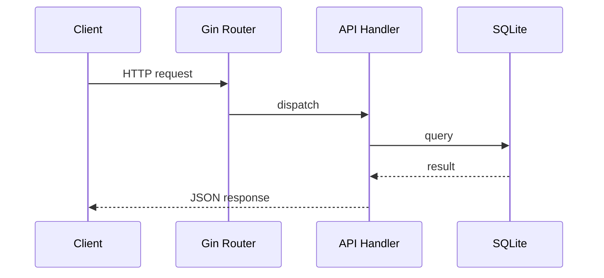

# Request Flow Overview

This document outlines how a typical API request flows through the NewsBalancer backend, from the moment it hits the HTTP endpoint until data is retrieved from the database and returned to the client.

## Steps

1. **Server Initialization**
   - `cmd/server/main.go` loads configuration, sets up services (database, LLM client, RSS collector, caches) and registers all routes.
2. **Routing**
   - Incoming requests are handled by the Gin router defined in `internal/api/api.go`.
3. **Handler Processing**
   - Each route points to a handler function (e.g., `getArticleByIDHandler`).
   - Handlers perform validation, call the DB layer, and may trigger LLM analysis or caching logic.
4. **Database Access**
   - Queries are executed via helper functions in `internal/db/db.go` using the established SQLite connection.
5. **Response**
   - Handlers format the data as JSON and send it back to the client.

## Sequence Diagram

