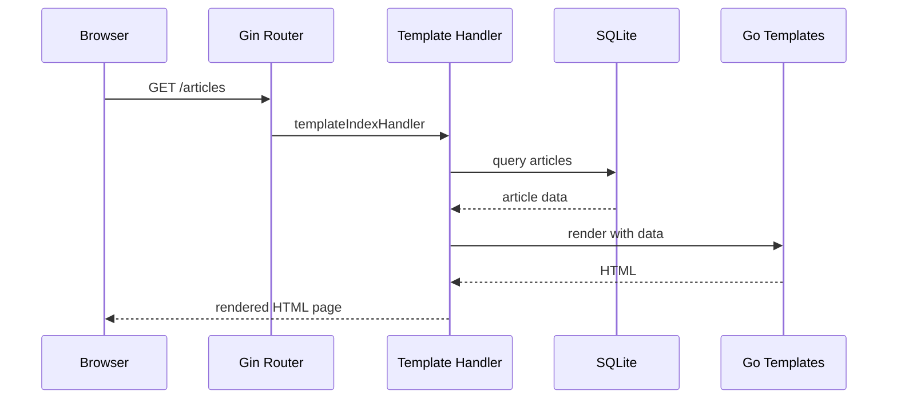
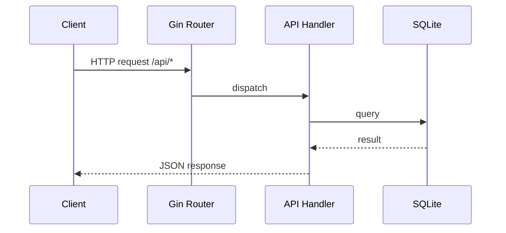

# Request Flow Overview

This document outlines how requests flow through the NewsBalancer backend, covering both API endpoints and Editorial template rendering, from the moment a request hits the HTTP endpoint until data is retrieved and returned to the client.

## Web Interface Request Types

### 1. Editorial Template Rendering (Default)
   - **Routes**: `/articles`, `/article/:id`
   - **Handler**: `templateIndexHandler`, `templateArticleHandler` in `cmd/server/template_handlers.go`
   - **Response**: Server-rendered HTML using Go templates with real database data

### 2. API Endpoints
   - **Routes**: `/api/articles`, `/api/articles/:id`, etc.
   - **Handler**: Functions in `internal/api/api.go`
   - **Response**: JSON data for client-side consumption

### 3. Static Assets
   - **Routes**: `/web/assets/*`
   - **Handler**: Gin static file serving
   - **Response**: CSS, JavaScript, images for Editorial template

## Request Flow Steps

1. **Server Initialization**
   - `cmd/server/main.go` loads configuration, sets up services (database, LLM client, RSS collector, caches, template engine) and registers all routes.
2. **Routing**
   - Incoming requests are handled by the Gin router defined in `internal/api/api.go` (API routes) or `cmd/server/main.go` (template routes).
3. **Handler Processing**
   - **Template Handlers**: Render Go templates with database data and return HTML
   - **API Handlers**: Perform validation, call the DB layer, may trigger LLM analysis or caching logic, return JSON
4. **Database Access**
   - Queries are executed via helper functions in `internal/db/db.go` using the established SQLite connection.
5. **Response**
   - **Template Response**: Rendered HTML with embedded data sent to browser
   - **API Response**: JSON data formatted and sent to client

## Sequence Diagrams

### Editorial Template Rendering Flow

### API Request Flow

