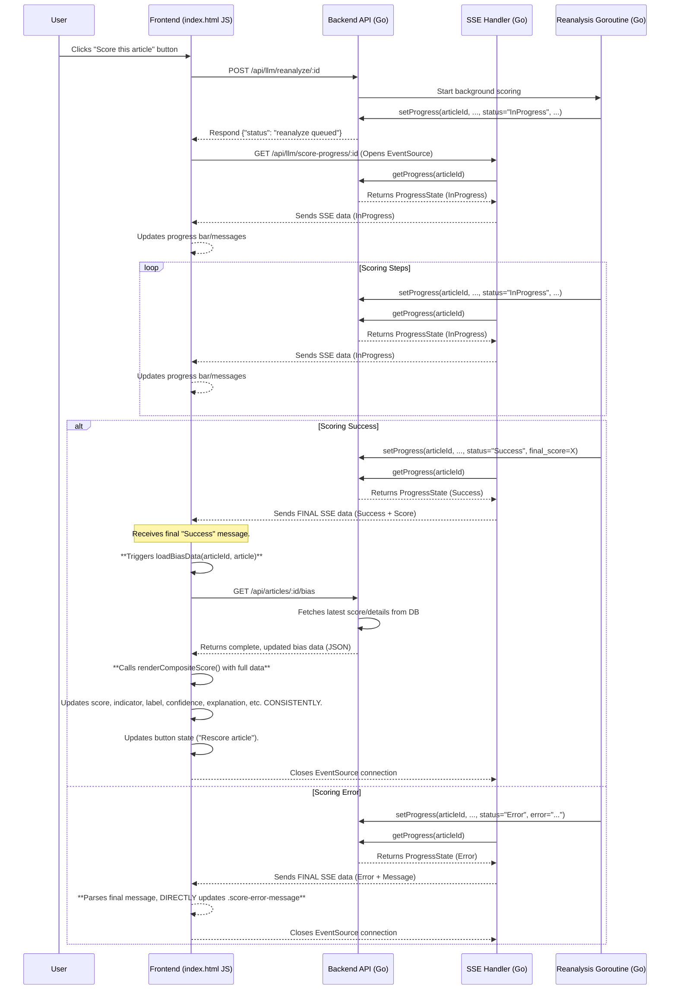

# Plan: SSE-Driven Final Score UI Update

**Date:** 2025-04-12
**Author:** Roo (Architect Mode)

## 1. Goal

Design a reliable mechanism using the existing SSE stream (`/api/llm/score-progress/:id`) to update the frontend UI with the final scoring result (score or error) after a manual re-analysis (`/api/llm/reanalyze/:id`) is triggered. This plan addresses reported issues with score display inaccuracy and progress reporting by ensuring a consistent UI state upon completion.

## 2. Final SSE Message Structure

The final message sent over the SSE stream will be a JSON representation of the backend's `ProgressState` struct.

*   **On Success:**
    ```json
    {
      "step": "Complete", // Or similar final step name
      "message": "Scoring complete",
      "percent": 100,
      "status": "Success",
      "error": "", // Empty on success
      "final_score": 0.75, // Example score value
      "last_updated": 1678886400 // Unix timestamp
    }
    ```
*   **On Error:**
    ```json
    {
      "step": "Error", // Or the step where the error occurred
      "message": "Error scoring with Model X", // User-friendly message
      "percent": 50, // Percentage at time of error
      "status": "Error",
      "error": "Detailed error message from backend", // Specific error
      "final_score": null, // Or potentially the score calculated before the error, if applicable
      "last_updated": 1678886400 // Unix timestamp
    }
    ```
    *Note: `article_id` is implicit, as the SSE connection is specific to an article.*

## 3. Backend Logic (`reanalyzeHandler` - Confirmation)

*   The existing background goroutine within `reanalyzeHandler` already calculates the final score or captures errors.
*   It correctly uses `setProgress` to update the shared `progressMap` with the final `ProgressState`, including `status: "Success"`, `final_score`, or `status: "Error"`, `error`.
*   **No changes are required** in `reanalyzeHandler` for sending the final state data structure.

## 4. Backend Logic (`scoreProgressSSEHandler` - Confirmation)

*   The existing `scoreProgressSSEHandler` polls the `progressMap` via `getProgress`.
*   It correctly marshals the `ProgressState` to JSON and sends it as SSE data.
*   It correctly identifies the final state (`progress.Status == "Success"` or `progress.Status == "Error"`) and closes the connection (`return`).
*   **No changes are required** in `scoreProgressSSEHandler` for sending the final state or closing the connection.

## 5. Frontend Logic (`web/index.html` - Refined Plan)

The `startScoring` function and its `evtSource.onmessage` handler will be refined as follows:

*   **Identify Final Message:** Inside `evtSource.onmessage`, explicitly check `if (progress.status === "Success" || progress.status === "Error")`.
*   **Handle Error:**
    *   If `status === "Error"`, parse the `error` message from `progress.error`.
    *   Display the error message in the `.score-error-message` element for that article.
    *   Update the progress bar to indicate failure (e.g., set background to red).
    *   Re-enable the button, potentially changing the label to "Retry Score".
    *   Close the SSE connection (`evtSource.close()`).
*   **Handle Success (Key Change):**
    *   If `status === "Success"`, parse the `final_score` from `progress.final_score`.
    *   **Trigger `loadBiasData(articleId, article)`:** This function will fetch the *complete* and *up-to-date* bias information from `/api/articles/:id/bias`.
    *   **Consistent Update:** `loadBiasData` uses the existing `renderCompositeScore` function to update *all* relevant UI elements (score, indicator, label, confidence, explanations, model details) consistently based on the complete fetched data.
    *   Update the progress bar to 100%.
    *   Add a final "Scoring complete!" message to `.score-progress-messages`.
    *   Re-enable the button, changing the label to "Rescore article".
    *   Close the SSE connection (`evtSource.close()`).

## 6. Mermaid Sequence Diagram (Refined Flow)



## 7. Conclusion

This refined plan leverages the existing backend infrastructure and focuses on triggering a full data refresh (`loadBiasData`) on the frontend upon receiving the final "Success" SSE message. This ensures a fully consistent UI state reflecting the re-analysis result, prioritizing accuracy and maintainability over the marginal speed gain of a partial direct update.