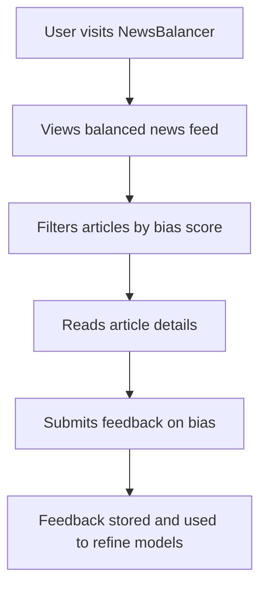
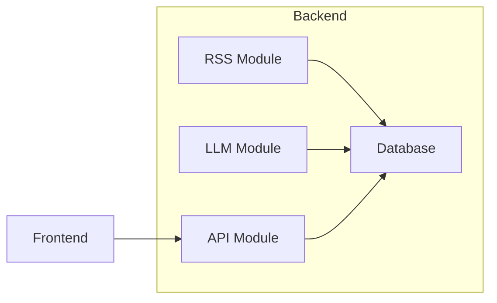
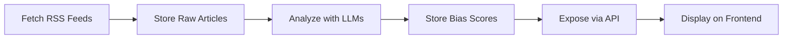
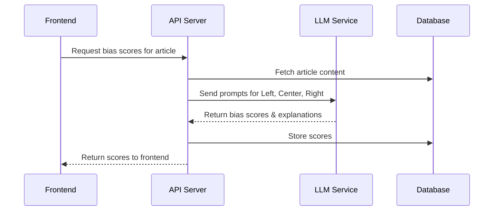

# Memory Bank Index & Guide

_Last updated: April 9, 2025_  
_Author: Roo AI Assistant_

---

## Overview

This directory contains the **core knowledge base** for the NewsBalancer project, including architecture, product vision, progress updates, and technical patterns. It serves as a **single source of truth** for design decisions, development status, and future plans.

---

## Recent Highlights (April 2025)

- Launched the **2025 redesign** featuring a **multi-model, multi-prompt ensemble** for nuanced, continuous bias scoring.
- Enhanced **API** with endpoints for user feedback and bias insights.
- Upgraded **frontend** with dynamic content, bias visualization, and inline feedback.
- Refined **prompt engineering** with configurable templates and few-shot examples.
- Integrated a **continuous validation and feedback loop** to improve model accuracy.
- Performed major **refactoring** and resolved key **SonarQube warnings** to improve code quality.
- See detailed documentation in [architecture_plan.md](architecture_plan.md), [activeContext.md](activeContext.md), and [progress.md](progress.md).

---

---

## Contents

### [architecture_plan.md](architecture_plan.md)
- **Purpose:** Comprehensive architectural roadmap.
- **Includes:**  
  - System objectives and phased implementation  
  - Multi-perspective bias detection  
  - Continuous bias scoring & ensemble redesign  
  - Risk assessment and mitigation  
  - Quality control and contingency plans  
  - Future enhancements  
  - Metadata and changelog

### [productContext.md](productContext.md)
- **Purpose:** Defines user needs, problem statement, and value proposition.
- **Planned expansions:**  
  - User personas and stories  
  - Market landscape and KPIs  
  - Competitive differentiation  
  - Metadata and changelog

### [progress.md](progress.md)
- **Purpose:** Tracks development progress, achievements, and next steps.
- **Includes:**  
  - Recent achievements  
  - Test status and diagnostics  
  - Upcoming milestones  
  - Planned expansions: blockers, retrospectives  
  - Metadata and changelog

### [systemPatterns.md](systemPatterns.md)
- **Purpose:** Documents backend architecture, data flow, and design patterns.
- **Includes:**  
  - Module breakdown  
  - Data flow steps  
  - Key design patterns  
  - Opportunities for improvement  
  - Planned expansions: error handling, security, sequence flows  
  - Metadata and changelog

---

## Update Guidelines

- **Add metadata and changelog** entries when modifying files.
- **Cross-reference** related sections across files.
- **Expand content** with detailed examples, personas, diagrams (where appropriate).
- **Use consistent markdown formatting** for clarity.
- **Log major decisions and rationale** to maintain project memory.

---

## Future Enhancements

- Tagging and keyword indexing for faster search.
- Automated changelog generation.
- Integration with CI/CD for status updates.
- Linking to external documentation and dashboards.

---

This index ensures **easy navigation, onboarding, and maintenance** of the project’s core knowledge base.

---

# API Examples

### Bias Scores Endpoint (`/api/bias`)

**Example Request:**
```http
GET /api/bias?article_id=123&min_score=-1&max_score=1&sort=asc HTTP/1.1
Host: localhost:8080
```

**Example Response:**
```json
{
  "results": [
    {
      "model": "gpt-4",
      "perspective": "Left",
      "score": -0.8,
      "explanation": "Language suggests a progressive viewpoint."
    },
    {
      "model": "gpt-4",
      "perspective": "Right",
      "score": 0.7,
      "explanation": "Highlights conservative talking points."
    }
  ]
}
```

**Error Response:**
```json
{
  "error": "Failed to fetch bias data"
}
```

---

# User Journeys



---

# Architecture & Workflows

### System Architecture



### Data Processing Workflow



### Bias Detection Sequence



---

# Bias Detection Examples

| Perspective | Score  | Explanation                                         |
|-------------|--------|-----------------------------------------------------|
| Left        | -0.9   | Emphasizes social justice themes                   |
| Center      | 0.0    | Neutral, factual reporting                         |
| Right       | 0.8    | Focuses on economic freedom, conservative values   |

### Edge Cases

- **Contradictory signals:**
  *Left: -0.2, Center: 0.1, Right: 0.7*
  → Mixed framing, subtle bias.

- **Ambiguous content:**
  *All scores near 0*
  → Likely neutral or vague article.

### Error Handling

- **Timeouts from LLM API:**
```json
{ "error": "LLM service unavailable, please retry later" }
```

- **Invalid article ID:**
```json
{ "error": "Article not found" }
```

---