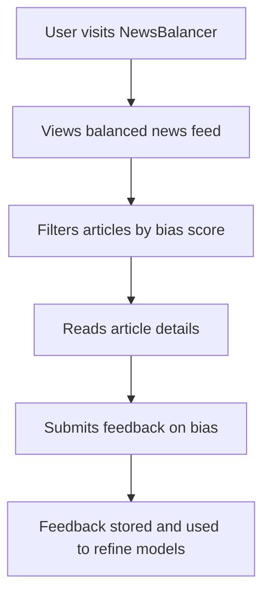
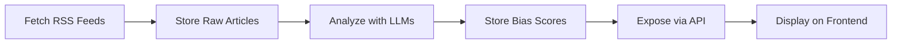
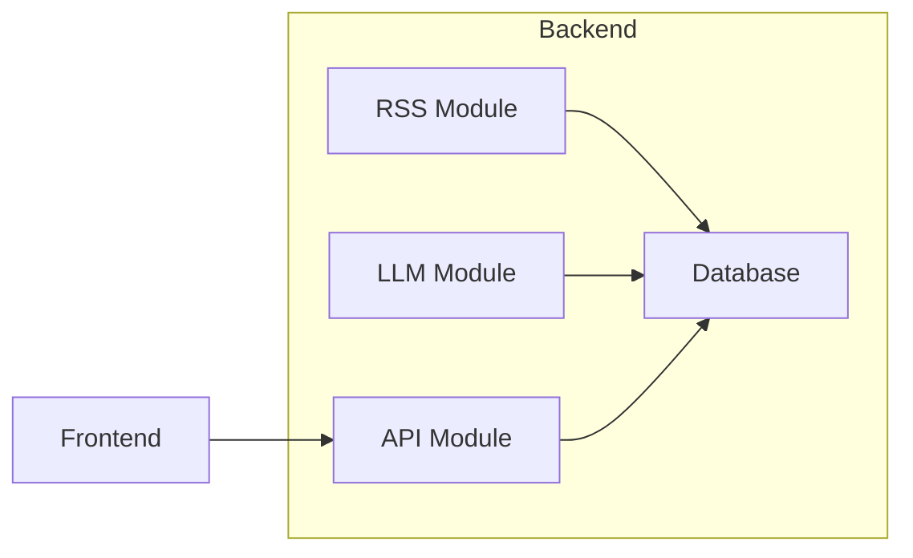
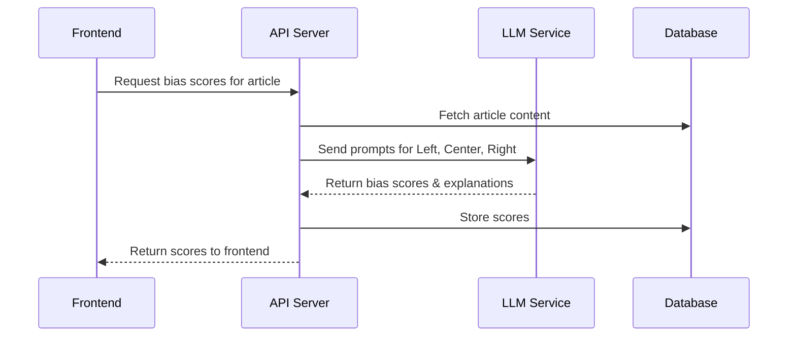

# Memory Bank Documentation Enhancement Plan

_Last updated: April 10, 2025_  
_Author: Roo AI Assistant_

---

## Objective

Enrich the `memory-bank/README.md` with concrete examples, visuals, and diagrams to improve clarity, onboarding, and technical understanding.

---

## Scope of Additions

### 1. API Call Examples

**Bias Scores Endpoint (`/api/bias`)**

- **Example Request:**
  ```http
  GET /api/bias?article_id=123&min_score=-1&max_score=1&sort=asc HTTP/1.1
  Host: localhost:8080
  ```
- **Example Response:**
  ```json
  {
    "results": [
      {
        "model": "gpt-4",
        "perspective": "Left",
        "score": -0.8,
        "explanation": "Language suggests a progressive viewpoint."
      },
      {
        "model": "gpt-4",
        "perspective": "Right",
        "score": 0.7,
        "explanation": "Highlights conservative talking points."
      }
    ]
  }
  ```
- **Error Response:**
  ```json
  {
    "error": "Failed to fetch bias data"
  }
  ```

**Other Endpoints**

- `/api/articles`
- `/api/articles/:id`
- `/api/refresh`
- `/api/reanalyze`
- `/api/summary`
- `/api/ensemble`
- `/api/feedback`

Provide similar request/response samples or summaries.

---

### 2. User Journey & Workflow Diagrams

**Example User Journey**



**Sample Workflow**



---

### 3. Architecture, Data Flow, and Sequence Diagrams

**High-Level Architecture**



**Bias Detection Sequence**



---

### 4. Concrete Examples of Bias Detection Outputs

| Perspective | Score  | Explanation                                         |
|-------------|--------|-----------------------------------------------------|
| Left        | -0.9   | Emphasizes social justice themes                   |
| Center      | 0.0    | Neutral, factual reporting                         |
| Right       | 0.8    | Focuses on economic freedom, conservative values   |

**Edge Cases**

- **Contradictory signals:**  
  *Left: -0.2, Center: 0.1, Right: 0.7*  
  → Mixed framing, subtle bias.

- **Ambiguous content:**  
  *All scores near 0*  
  → Likely neutral or vague article.

**Error Handling**

- **Timeouts from LLM API:**
  ```json
  { "error": "LLM service unavailable, please retry later" }
  ```
- **Invalid article ID:**
  ```json
  { "error": "Article not found" }
  ```

---

### 5. Summary of Additions

- API examples with request/response samples.
- User journey diagram.
- Workflow diagram.
- Architecture diagram.
- Sequence diagram.
- Concrete bias detection outputs and edge cases.
- Error handling examples.

---

## Implementation Approach

- Embed these examples and diagrams **directly into `memory-bank/README.md`**.
- Use **Mermaid** for diagrams.
- Cross-link to detailed docs (`architecture_plan.md`, `systemPatterns.md`) where relevant.
- Maintain consistent formatting and update metadata.

---

## Mermaid Diagram of This Plan

```mermaid
flowchart TD
    subgraph Plan
        A(API Examples)
        B(User Journeys)
        C(Architecture & Workflows)
        D(Bias Detection Examples)
        E(Summary)
    end
    A --> E
    B --> E
    C --> E
    D --> E