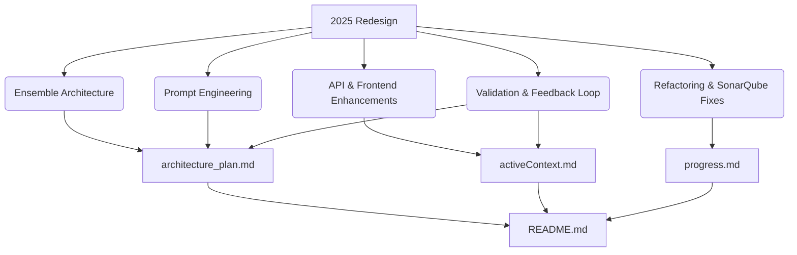

# Memory Bank Update Plan (April 9, 2025)

---

## Objective

Update the `memory-bank` markdown files to reflect the latest project state, highlighting:

- The 2025 redesign and ensemble architecture
- API and frontend enhancements
- Prompt engineering improvements
- Continuous validation and feedback loop
- Major refactoring and SonarQube warning resolutions
- Ensure clarity, accuracy, and cross-references

---

## Target Files

- `memory-bank/activeContext.md`
- `memory-bank/architecture_plan.md`
- `memory-bank/progress.md`
- `memory-bank/README.md`

---

## Planned Updates

### 1. `architecture_plan.md`

- Add a highlight summary of the 2025 redesign, ensemble, prompt engineering, and validation loop.
- Cross-reference detailed sections already present.
- Note major refactoring and SonarQube fixes as part of the redesign.

### 2. `activeContext.md`

- Add a summary paragraph explicitly mentioning:
  - Ensemble implementation now live
  - API enhancements (feedback endpoints, bias insights)
  - Frontend improvements (dynamic UI, feedback forms)
  - Prompt engineering refinements
  - Validation loop integration
  - Major refactoring and SonarQube warning resolutions

### 3. `progress.md`

- Expand recent achievements to include:
  - Ensemble implementation completion
  - API/frontend upgrades
  - Prompt engineering improvements
  - Validation loop integration
  - Major refactoring efforts
  - SonarQube warning resolutions
- Add a new section summarizing the impact of these changes on stability, accuracy, and maintainability.

### 4. `README.md`

- Add a "Recent Highlights" section summarizing:
  - The 2025 redesign and ensemble
  - API/frontend improvements
  - Prompt engineering refinements
  - Validation loop
  - Refactoring and SonarQube fixes
- Cross-reference the detailed files for more info.

---

## Cross-References

- Link to specific sections in `architecture_plan.md` and `activeContext.md` for ensemble, prompt engineering, and validation loop.
- Mention that progress and changelogs are in `progress.md`.

---

## Mermaid Diagram

---

## Summary

This plan ensures the documentation accurately reflects the current state of the project, highlights key improvements, and maintains clarity and cross-references across the knowledge base.